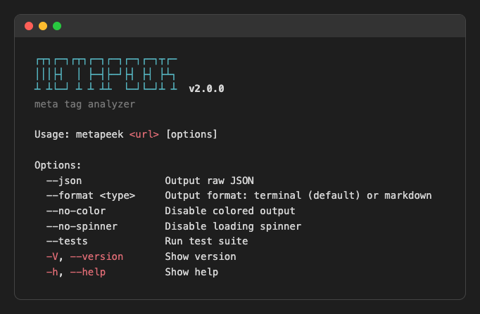

# metapeek-cli

CLI tool for analyzing meta tags and social sharing readiness.

This is the command-line interface for [metapeek](https://metapeek.icjia.app) — the web-based meta tag analyzer. The CLI is fully self-contained and analyzes pages directly — no external API required. Use it for CI/CD pipelines, scripts, or quick terminal analysis.

**Web app:** https://metapeek.icjia.app

**Web app source:** https://github.com/ICJIA/icjia-metapeek



## CLI vs. Web App

The CLI and the web app perform the same core analysis — scoring meta tags across 7 categories with the same weights and grading scale — but they differ in architecture, dependencies, and use cases.

### How They Work

| | **CLI (`metapeek`)** | **Web App (metapeek.icjia.app)** |
|---|---|---|
| **Language** | Bash + embedded Python | TypeScript (Nuxt/Nitro on Netlify) |
| **HTML fetching** | Python `urllib.request` (stdlib) | Node `fetch` via Nitro server route with redirect chain tracking |
| **HTML parsing** | Python `html.parser.HTMLParser` (stdlib) | [cheerio](https://cheerio.js.org/) (jQuery-like DOM API) |
| **Infrastructure** | Runs on your machine | Netlify Functions (serverless) |
| **API endpoints** | None — all logic runs locally | `POST /api/fetch` (proxy) and `GET /api/analyze?url=` (full analysis) |
| **Rate limiting** | None — it's your machine | 10 requests per 60 seconds per IP (Netlify edge) |
| **SSRF protection** | Protocol validation only | DNS resolution checks, private IP blocking, CORS, optional API key |
| **Dependencies** | `python3` (stdlib only) + `jq` | ~20 npm packages (Nuxt, Vue, cheerio, etc.) |

### What the CLI Parses

The CLI extracts 7 categories from the `<head>` section: title, meta description, Open Graph (og:title, og:description, og:image), OG image URL format and dimensions, Twitter Card, canonical URL, and robots directives. When an og:image is present, the CLI fetches the first 64KB of the image to parse dimensions from PNG, JPEG, GIF, and WebP headers. Images below the recommended 1200x630 minimum trigger a scoring warning.

### What the Web App Parses

The web app extracts everything the CLI does plus: viewport, theme-color, author, keywords, language, generator, favicon, full OG metadata (locale, site_name, type, video, audio, image dimensions), Facebook app/admin IDs, article metadata (author, published/modified time, section, tags), full Twitter Card metadata (site, creator, labels/data), Pinterest tags, Apple/iOS tags, Microsoft tile tags, and JSON-LD structured data.

### Pros and Cons

**CLI**

| Pros | Cons |
|---|---|
| Zero infrastructure — runs anywhere with Python 3 and jq | Terminal-only output (no visual previews) |
| No network dependency beyond the target URL itself | The web app still shows more platform-specific tags (Apple/iOS, Microsoft tile, Pinterest) |
| Machine-readable output (JSON, exit codes) for scripting | No social preview cards (Facebook, Twitter, LinkedIn) |
| Works in CI/CD pipelines, pre-commit hooks, and cron jobs | No browser-based OG image rendering |
| No rate limits — analyze as many URLs as you want | Requires a Unix shell (bash) |
| Offline-capable for testing local dev servers |  |
| Single file — no install step, no package manager |  |

**Web App**

| Pros | Cons |
|---|---|
| Visual social preview cards (Facebook, Twitter, LinkedIn) | Requires internet access to the Netlify-hosted service |
| Richer metadata extraction (Apple/iOS, Microsoft tile, Pinterest tags) | Rate limited to 10 requests per minute |
| Interactive UI with color-coded diagnostics | Cannot be used in CI/CD or automated pipelines |
| No local dependencies — just a browser | No machine-readable output for scripting |
| Social card previews show exactly what users will see when sharing | Depends on Netlify infrastructure being available |

### Why Use the CLI?

Use the CLI when you need **automation, repeatability, or integration** with development workflows. The web app is better for **visual inspection and one-off checks**.

#### User Stories

- **As a developer**, I want to check meta tags before every deploy so that broken social previews never reach production.

  ```bash
  # CI/CD pipeline gate — fails the build on grade C or below
  metapeek https://staging.example.com || exit 1
  ```

- **As a DevOps engineer**, I want to monitor meta tags across all our sites on a schedule so that regressions are caught automatically.

  ```bash
  # Cron job scanning multiple sites
  for url in https://site-a.example.com https://site-b.example.com; do
    metapeek "$url" --json >> /var/log/metapeek.jsonl
  done
  ```

- **As a content author**, I want a quick terminal check after editing page metadata so that I know the changes look right without leaving my editor.

  ```bash
  metapeek https://dev.example.com/my-new-post
  ```

- **As a QA tester**, I want to verify that meta tags meet our standards as part of our test suite so that SEO requirements are enforced.

  ```bash
  # In a test script — exit code 1 means grade C/D/F
  metapeek https://staging.example.com --json | jq -e '.score.grade == "A"'
  ```

- **As a developer working offline or behind a VPN**, I want to analyze meta tags on my local dev server so that I can iterate without deploying.

  ```bash
  metapeek http://localhost:3000
  ```

- **As a team lead**, I want to pipe analysis results into our reporting tools so that meta tag quality is tracked over time.

  ```bash
  metapeek https://example.com --json | jq '{url: .url, score: .score.overall, grade: .score.grade}'
  ```

## Platform Support

metapeek requires a Unix shell (bash). It runs on:

- **macOS**

- **Linux**

- **Windows via WSL2**

> **Windows note:** metapeek does not run in PowerShell or Command Prompt. You must use [WSL2](https://learn.microsoft.com/en-us/windows/wsl/install) with a Linux distribution (e.g. Ubuntu) to run on a Windows machine.

## Install

### Option 1: Clone and run directly

```bash
git clone https://github.com/ICJIA/icjia-metapeek-cli.git
cd icjia-metapeek-cli
chmod +x metapeek
./metapeek https://github.com
```

### Option 2: Clone and add to your PATH

```bash
git clone https://github.com/ICJIA/icjia-metapeek-cli.git
ln -s "$(pwd)/icjia-metapeek-cli/metapeek" /usr/local/bin/metapeek
```

### Option 3: Direct download

```bash
curl -fsSL https://raw.githubusercontent.com/ICJIA/icjia-metapeek-cli/main/metapeek -o /usr/local/bin/metapeek && chmod +x /usr/local/bin/metapeek
```

### Permissions

If you get a `Permission denied` error when running `./metapeek`, set the executable bit:

```bash
chmod +x metapeek
```

If `ln -s` or downloading to `/usr/local/bin` fails with a permissions error, use `sudo`:

```bash
sudo ln -s "$(pwd)/icjia-metapeek-cli/metapeek" /usr/local/bin/metapeek
```

Or install to your user-local bin directory instead (no `sudo` needed):

```bash
mkdir -p ~/.local/bin
ln -s "$(pwd)/icjia-metapeek-cli/metapeek" ~/.local/bin/metapeek
```

Make sure `~/.local/bin` is in your `PATH`. Add this to your `~/.zshrc` or `~/.bashrc` if it isn't:

```bash
export PATH="$HOME/.local/bin:$PATH"
```

## Requirements

metapeek requires two dependencies:

| Dependency | Version | Purpose |
| ---------- | ------- | ------- |
| `python3` | 3.6+ | Runs the built-in meta tag analyzer (stdlib only — no pip packages needed) |
| `jq` | any | Parses JSON output from the analyzer for terminal formatting |

If either dependency is missing, metapeek will exit with a clear error message and platform-specific install instructions so you know exactly what to run before trying again:

```
Error: missing required dependencies: python3 jq

Install them:
  macOS:  xcode-select --install   # provides python3
          brew install jq
```

### Installing dependencies

**macOS:**

```bash
xcode-select --install   # provides python3 (already available on most Macs)
brew install jq
```

**Ubuntu / WSL2:**

```bash
sudo apt install python3 jq
```

> **Tip:** Run `python3 --version` and `jq --version` to check if they're already installed. On macOS, if `python3` prompts you to install developer tools, follow the prompt or run `xcode-select --install`.

## Quickstart

Try these two URLs right after installing to see the full range of output:

**A perfect score (no issues):**

```bash
metapeek https://r3.illinois.gov
```

```
metapeek — https://r3.illinois.gov

  Score: 100/100 (A)

  ✓ Title          100  Title is 28 characters
  ✓ Description    100  Description is 135 characters
  ✓ Open Graph     100  All required OG tags present
  ✓ OG Image       100  og:image is present and absolute (1200x630)
  ✓ Twitter Card   100  twitter:card is "summary_large_image"
  ✓ Canonical      100  Canonical URL is set
  ✓ Robots         100  No blocking directives

  Metadata

  title                Restore, Reinvest, Renew: R3
  description          R3 grants fund programs in Illinois communities that have been harmed by viol...
  canonical            https://r3.illinois.gov/
  og:title             Restore, Reinvest, Renew: R3
  og:image             https://r3.illinois.gov/og-image.png
  og:image size        1200x630
  twitter:card         summary_large_image

  0 issues found

  Analyzed in 234ms
  ✓ Pass (exit 0) — grade A
```

**A site with warnings:**

```bash
metapeek https://github.com
```

```
metapeek — https://github.com

  Score: 84/100 (B)

  ⚠ Title          60  Title is 61 characters
  ⚠ Description    60  Description is 186 characters
  ✓ Open Graph     100  All required OG tags present
  ✓ OG Image       100  og:image is present and absolute (1200x630)
  ✓ Twitter Card   100  twitter:card is "summary_large_image"
  ⚠ Canonical      60  Trailing slash inconsistency with og:url
  ✓ Robots         100  No blocking directives

  Metadata

  title                GitHub: Let's build from here · GitHub
  description          GitHub is where over 100 million developers shape the future of software, tog...
  canonical            https://github.com
  og:title             GitHub: Let's build from here
  og:image             https://github.githubassets.com/assets/campaign-social-031d6161fa10.png
  og:image size        1200x630
  twitter:card         summary_large_image

  3 issues found

  Issues:

  ✗ Title
    • Title exceeds 60 characters (61)
    → Keep the title under 60 characters for best display in search results.

  ✗ Description
    • Description exceeds 160 characters (186)
    → Keep the meta description under 160 characters for best display in search results.

  ✗ Canonical
    • Trailing slash inconsistency with og:url
    → Canonical lacks trailing slash but og:url has it. Choose one format and use it consistently across canonical, og:url, and all meta tags.


─────────────────────────────────────────────────────────
Copy for LLM
─────────────────────────────────────────────────────────

URL: https://github.com
Score: 84/100 (B)

Issues:
- Title exceeds 60 characters (61)
  Fix: Keep the title under 60 characters for best display in search results.
- Description exceeds 160 characters (186)
  Fix: Keep the meta description under 160 characters for best display in search results.
- Trailing slash inconsistency with og:url
  Fix: Canonical lacks trailing slash but og:url has it. Choose one format and use it consistently across canonical, og:url, and all meta tags.


  Analyzed in 268ms
  ✓ Pass (exit 0) — grade B
```

When issues or warnings are found, the output includes:

- **Issues detail** — each warning or failing category with its specific problems and a suggested fix
- **Copy for LLM** — a plain-text block you can copy-paste into ChatGPT, Claude, or any LLM to get help fixing the issues

## Usage

```
metapeek <url> [options]

Options:
  --json              Output raw JSON
  --format <type>     Output format: terminal (default) or markdown
  --full              Show all extracted metadata (default)
  --no-color          Disable colored output
  --no-spinner        Disable loading spinner
  --tests             Run test suite
  -V, --version       Show version
  -h, --help          Show help
```

## More Examples

### JSON output

```bash
metapeek https://github.com --json
```

### Markdown output

```bash
metapeek https://github.com --format markdown
```

### Full metadata

All extracted metadata (Open Graph, Twitter Card, image dimensions, favicons, JSON-LD structured data) is shown by default. The `--full` flag is accepted for backward compatibility but has no additional effect.

### Piping

```bash
metapeek https://github.com --json | jq .score.grade
```

## Exit Codes

Every run prints its exit status at the end of the output (e.g. `✓ Pass (exit 0) — grade A`), so the meaning is always visible.

| Code | Meaning                                                       |
| ---- | ------------------------------------------------------------- |
| 0    | Grade A or B                                                  |
| 1    | Grade C, D, or F                                              |
| 2    | Error (invalid URL, missing deps, network failure)            |

## Security

metapeek is hardened against common attack vectors:

- **ANSI injection prevention** — All analyzer output (both success and error messages) is sanitized to strip control characters before display, preventing malicious terminal escape sequences
- **Shell injection prevention** — URLs are properly quoted and encoded, preventing command injection via shell metacharacters
- **Protocol validation** — Only `http://` and `https://` URLs are accepted; `javascript:`, `data:`, `file://`, `ftp://`, and other schemes are rejected
- **Strict error handling** — The script runs with `set -euo pipefail` to catch errors early and prevent undefined behavior

All security measures are validated by 9 dedicated tests in the test suite.

## Testing

metapeek includes a comprehensive test suite covering all features and edge cases.

### Run Tests

```bash
# Run all tests (includes live analysis)
./test/run.sh

# Run only offline tests (skip network-dependent tests)
./test/run.sh --offline
```

### Test Coverage

The test suite includes **66 tests** across 10 categories:

- **Flags & argument parsing** (14 tests) — validates all CLI options, version output, help text
- **Error handling** (12 tests) — invalid URLs, missing arguments, unknown options, invalid format values
- **URL normalization** (5 tests) — protocol prepending, validation of http/https/ftp/mailto/file schemes
- **Live analysis — terminal output** (10 tests) — score display, category rows, issues section, LLM copy block, exit hints
- **Live analysis — JSON output** (3 tests) — valid JSON structure, expected fields, no ANSI code leakage
- **Live analysis — markdown output** (3 tests) — heading format, table structure, result line
- **No-color output** (1 test) — ANSI escape sequence stripping
- **Full metadata output** (5 tests) — `--full` flag acceptance, metadata section display, JSON meta key, markdown metadata heading
- **Image dimension checking** (4 tests) — JSON dimension data, width/height values, terminal and markdown display
- **Security** (9 tests) — shell injection prevention, control character sanitization, protocol restrictions

Tests analyze `https://r3.illinois.gov` (grade A, no issues) and `https://github.com` (grade B, warnings for title/description length and trailing slash inconsistency) to verify output formatting.

### Test Output

Passing tests show a green checkmark (✓), failed tests show details:

```
  metapeek test suite
  ═══════════════════

  Flags & argument parsing
  ────────────────────────
  ✓ --help exits 0
  ✓ --version prints version
  ...

  ═══════════════════
  66 passed (66 total)
```

## License

MIT
